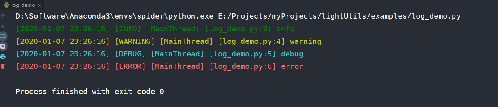

# lightUtils
本项目仅为自己的Python常用工具类。

其中有些是自己写的，有的则是网上找的，由于有些还需要copy代码到相应需求处才能使用，比如说放在gist或其他代码片段保存工具并不太方便，所以这里也构建一个库，用的时候先`install`然后直接`import`就好了。

## 功能

1. 彩色日志
2. 获取系统可用tcp端口
3. 从文件中逐行获取json对象
4. 发送邮件
5. 将时间间隔（s为单位）转换为日时分秒表示
6. 将迭代器转化为批量数据返回形式
7. 执行系统命令并获取执行结果
8. 检查文件是否存在以及是否对应相应拓展名
9. 获取文件名，不含拓展名
10. 将迭代器截断，只返回前面部分
11. 获取变量名
12. 获取变量类型和属性信息
13. 将可序列化对象以json格式写入文件中
14. 比较两个字符串差异，高亮差异部分
15. 根据项目名和当前脚本路径检测项目路径并添加至系统路径
16. 读取yaml文件
17. 终端彩色输出

## 使用

### 1.彩色日志

#### 示例
```python
from lightutils import logger

logger.info("info")
logger.warning('warning')
logger.debug('debug')
logger.error('error')
```

效果如图：


### 2.获取系统可用tcp端口

#### 示例
```python
from lightutils import get_free_tcp_port

port = get_free_tcp_port()
print(port)
```

执行结果为：
```bash
49783
<class 'int'>
```

### 3.从文件中逐行获取json对象

从文件中逐行获取json对象，

#### 示例

```python
from lightutils import read_json_line

for obj in read_json_line('test.json'):
    print(obj)
```

执行结果为：
```bash
{'info': {'word': '丘为', 'means': [['寻西山隐者不遇', '寻西山隐者不遇'], ['左掖梨花', '左掖梨花']]}, 'type': 'ambiguous'}
{'info': {'word': '丘为', 'means': [['寻西山隐者不遇', '寻西山隐者不遇'], ['左掖梨花', '左掖梨花']]}, 'type': 'ambiguous'}
```

原文件内容为：
```json
{"info": {"word": "丘为", "means": [["寻西山隐者不遇", "寻西山隐者不遇"], ["左掖梨花", "左掖梨花"]]}, "type": "ambiguous"}
{asdf}
{"info": {"word": "丘为", "means": [["寻西山隐者不遇", "寻西山隐者不遇"], ["左掖梨花", "左掖梨花"]]}, "type": "ambiguous"}
```

错误输出日志`error.log`内容如下：
```text
line2: {asdf}

```

### 4.发送邮件

使用Python发送一封邮件

#### 示例

```python
from lightutils import send_email_notification

to = "iamlightsmile@qq.com"
subject = "just a test"
contents = ["the test of lightUtils's send_email_notification function"]
result = send_email_notification(to, subject, contents)
if result:
    print("发送成功！")
else:
    print("发送失败！")
```

#### 运行结果：

```text
发送成功！
```

#### 效果截图：


### 5.将时间间隔（s为单位）转换为日时分秒表示

#### 使用示例

```python
from lightutils import time_convert

print(time_convert(10000000.234))
print(time_convert(1000000.0))
print(time_convert(100000.0))
print(time_convert(10000.0))
print(time_convert(1000.0))
print(time_convert(100.0))
print(time_convert(10.0))
print(time_convert(1.0))
print(time_convert(0.0))
```

#### 运行结果：

```text
115天17小时46分钟40.23秒
11天13小时46分钟40.0秒
1天3小时46分钟40.0秒
2小时46分钟40.0秒
16分钟40.0秒
1分钟40.0秒
10.0秒
1.0秒
0.0秒
```

### 6.将迭代器转化为批量数据返回形式

#### 使用示例

```python
from lightutils import batch

if __name__ == '__main__':
    for item in batch(range(100)):
        print(item)
```

#### 运行结果：

```text
[0, 1, 2, 3, 4, 5, 6, 7, 8, 9]
[10, 11, 12, 13, 14, 15, 16, 17, 18, 19]
[20, 21, 22, 23, 24, 25, 26, 27, 28, 29]
[30, 31, 32, 33, 34, 35, 36, 37, 38, 39]
[40, 41, 42, 43, 44, 45, 46, 47, 48, 49]
[50, 51, 52, 53, 54, 55, 56, 57, 58, 59]
[60, 61, 62, 63, 64, 65, 66, 67, 68, 69]
[70, 71, 72, 73, 74, 75, 76, 77, 78, 79]
[80, 81, 82, 83, 84, 85, 86, 87, 88, 89]
[90, 91, 92, 93, 94, 95, 96, 97, 98, 99]
```

### 7.执行系统命令并获取执行结果

#### 使用示例

```python
from lightutils import execute_cmd

if __name__ == '__main__':
    state, info = execute_cmd('ls')
    if state:
        print(info)
```

#### 运行结果：

```text
chunk_demo.py
cmd_demo.py
error.log
json_file_demo.py
log_demo.py
port_demo.py
send_email_demo.py
test.json
time_convert_demo.py
```

### 8.检查文件是否存在以及是否对应相应拓展名

#### 使用示例

```text
from lightutils import check_file

if __name__ == '__main__':
    # check_file('fuck.txt', 'txt')
    check_file('file_demo.py', 'txt')
    # check_file('file_demo.py', 'py')
```

#### 运行效果

```text
Traceback (most recent call last):
  File "E:/Projects/myProjects/lightUtils/examples/file_demo.py", line 10, in <module>
    check_file('file_demo.py', 'txt')
  File "E:\Projects\myProjects\lightUtils\lightutils\common\file.py", line 25, in check_file
    raise NotSpecifiedFileException('xx.' + ext)
lightutils.common.file.NotSpecifiedFileException: 并非指定的文件错误，应该是形如：xx.txt
```

### 9.获取文件名，不含拓展名

#### 使用示例

```python
from lightutils import get_file_name

if __name__ == '__main__':
    print(get_file_name("hello_world.py"))
```

#### 运行效果

```text
hello_world
```

### 10.将迭代器截断，只返回前面部分

#### 使用示例

```python
from lightutils import cutoff_iter

if __name__ == '__main__':

    for item in cutoff_iter(range(20)):
        print(item)
```

#### 运行效果

```text
0
1
2
3
4
5
6
7
8
9
```

### 11. 获取变量名

#### 使用示例

```python
from lightutils import retrieve_name

if __name__ == '__main__':
    a = 3
    print(retrieve_name(a))
```

```text
a
```

#### 运行效果

### 12. 获取变量类型和属性信息

#### 使用示例

```python
from lightutils import inspect_variable

if __name__ == '__main__':
    a = 3
    print(inspect_variable(a))
```

#### 运行效果

```text
{'name': 'a', 'type': "<class 'int'>", 'attrs': "['__abs__', '__add__', '__and__', '__bool__', '__ceil__', '__class__', '__delattr__', '__dir__', '__divmod__', '__doc__', '__eq__', '__float__', '__floor__', '__floordiv__', '__format__', '__ge__', '__getattribute__', '__getnewargs__', '__gt__', '__hash__', '__index__', '__init__', '__init_subclass__', '__int__', '__invert__', '__le__', '__lshift__', '__lt__', '__mod__', '__mul__', '__ne__', '__neg__', '__new__', '__or__', '__pos__', '__pow__', '__radd__', '__rand__', '__rdivmod__', '__reduce__', '__reduce_ex__', '__repr__', '__rfloordiv__', '__rlshift__', '__rmod__', '__rmul__', '__ror__', '__round__', '__rpow__', '__rrshift__', '__rshift__', '__rsub__', '__rtruediv__', '__rxor__', '__setattr__', '__sizeof__', '__str__', '__sub__', '__subclasshook__', '__truediv__', '__trunc__', '__xor__', 'bit_length', 'conjugate', 'denominator', 'from_bytes', 'imag', 'numerator', 'real', 'to_bytes']"}
```

### 13. 将可序列化对象以json格式写入文件中

#### 使用示例

```python
from lightutils import write_json_line

if __name__ == '__main__':
    with open('./write_json.json', 'w', encoding='utf-8') as file:
        write_json_line(file, {'a': 3})
```

#### 运行效果

`write_json.json`文件内容：
```text
{"a": 3}
```

### 14. 比较两个字符串差异，高亮差异部分

代码主要是copy自苏神的[bojone/text_compare: 用python比较两个字符串差异，高亮差异部分](https://github.com/bojone/text_compare)

#### 使用示例

```python
from lightutils import string_compare

if __name__ == '__main__':
    a = "上周去钓鱼"
    b = "上周去爬山"
    string_compare(a, b)
```

#### 运行效果


### 15. 根据项目名和当前脚本路径检测项目路径并添加至系统路径

主要应用场景是在一个项目中需要根据路径去添加和使用包，这里提供程序自动检测的功能，以使得不必操心具体相对路径位置，只要提供程序包名即可。

#### 使用示例

```python
from lightutils import add_sys_path

project_path = 'lightutils'

if __name__ == '__main__':
    add_sys_path(__file__, project_path)
```

#### 运行结果

```bash
D:\Software\Anaconda3\envs\spider\python.exe E:/Projects/myProjects/lightUtils/examples/add_path_demo.py
[2020-09-11 10:24:47] [INFO] [MainThread] [path.py:27] 已成功将E:/Projects/myProjects/lightUtils添加至系统路径
```

### 16.读取yaml文件

```python
# -*- coding: utf-8 -*-
from lightutils import load_yaml

yaml_path = 'test.yml'

if __name__ == '__main__':
    print(load_yaml(yaml_path))
```

`test.yml`文件内容：

```yaml
test: 3
```

程序运行结果：

```shell script
{'test': 3}
```

### 17.终端彩色输出

```python
from lightutils import color

print(color.green("green"))
```

## 参考
1. [lightless233/colorlog: Python彩色log模块封装](https://github.com/lightless233/colorlog)
2. [Getting a random free tcp port in python using sockets](https://gist.github.com/gabrielfalcao/20e567e188f588b65ba2)
3. [kootenpv/yagmail: Send email in Python conveniently for gmail using yagmail](https://github.com/kootenpv/yagmail)
4. [Python最良心的邮件发送库--yagmail_Detector_的博客-CSDN博客](https://blog.csdn.net/Detector_/article/details/79673875)
5. [Python用QQ邮箱发送邮件时授权码问题_wateryouyo的博客-CSDN博客](https://blog.csdn.net/wateryouyo/article/details/51766345)
6. [python - how to split an iterable in constant-size chunks - Stack Overflow](https://stackoverflow.com/questions/8290397/how-to-split-an-iterable-in-constant-size-chunks)
7. [python获取系统信息模块详解 - 编程语言 - 亿速云](https://www.yisu.com/zixun/46486.html)
8. [Python中调用命令行的几种方法 - 简书](https://www.jianshu.com/p/5320ff8046b2)
9. [python如何将变量名转化为同名字符串？ - 知乎](https://www.zhihu.com/question/42768955)
10. [bert4keras/snippets.py at master · bojone/bert4keras](https://github.com/bojone/bert4keras/blob/master/bert4keras/snippets.py)
11. [bojone/text_compare: 用python比较两个字符串差异，高亮差异部分](https://github.com/bojone/text_compare)
12. [reorx/python-terminal-color: Drop-in single file library for printing color in terminal](https://github.com/reorx/python-terminal-color)

## 打赏

如果该项目对您有所帮助，欢迎打赏~


